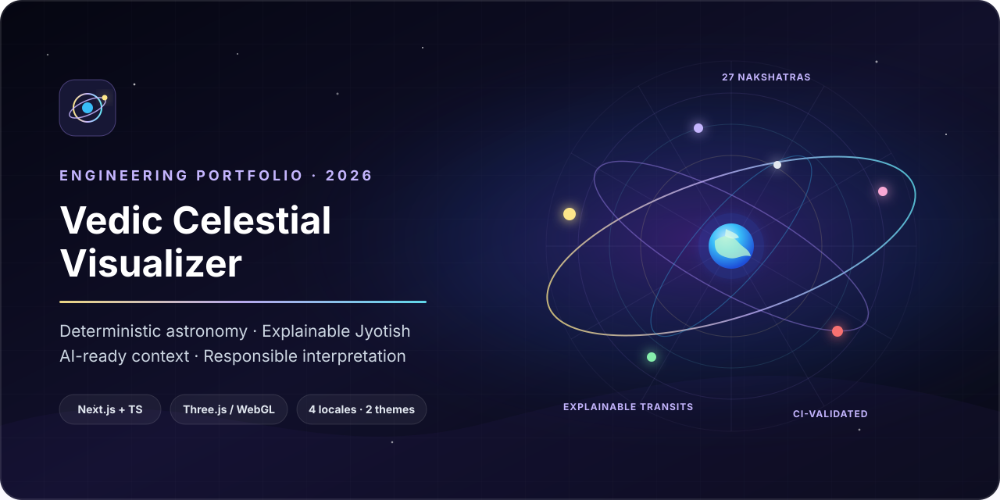
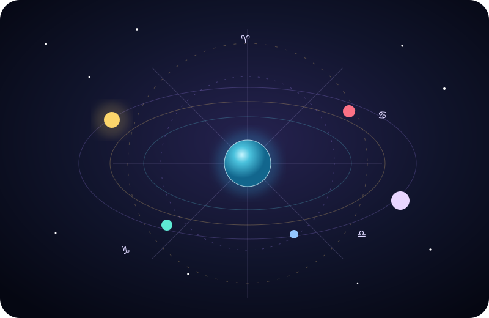
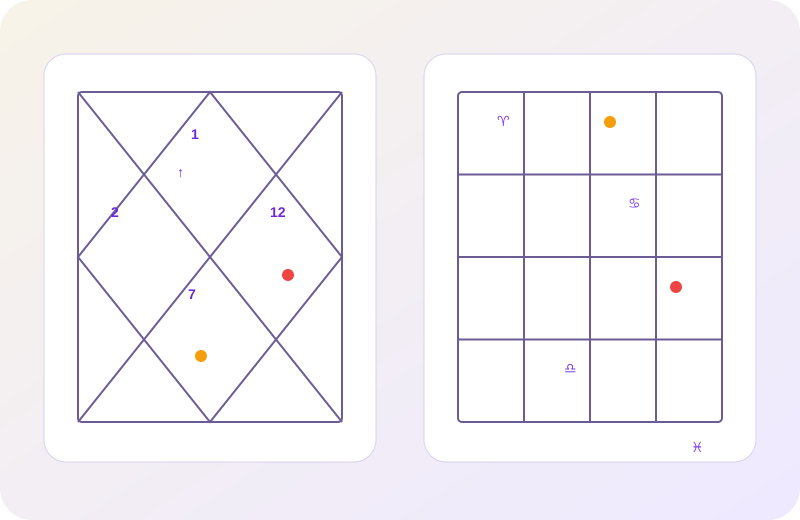
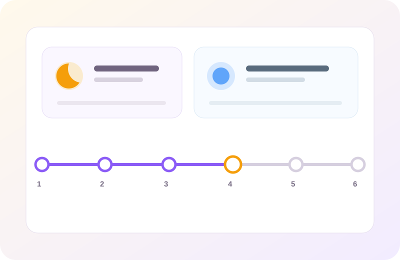
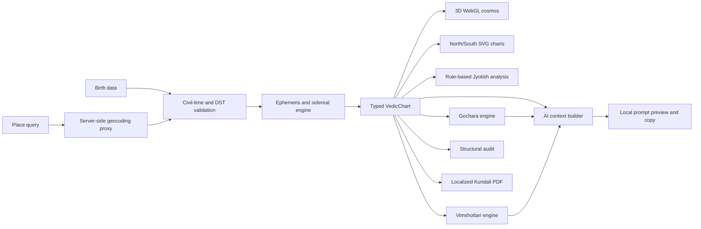

# Vedic Celestial Visualizer



<p align="center">
  <strong>A deterministic astronomy engine, explainable Jyotish workspace,
  interactive WebGL experience, and AI-ready context pipeline in one
  production-oriented TypeScript application.</strong>
</p>

<p align="center">
  <a href="https://github.com/diprajkadlag/VedicAstrologer/actions/workflows/ci.yml">
    
  </a>
  
  
  
  
  
</p>

## Try it — nothing to install

**<https://diprajkadlag.github.io/VedicAstrologer/>**

Runs entirely in the browser, on a phone as well as a desktop. There is no
server and no account: your birth details never leave the device. Place search
is the one network call, and it goes straight from your browser to
[Nominatim](https://nominatim.openstreetmap.org/) (© OpenStreetMap
contributors); the timezone for a place is resolved on-device.

To run it locally instead, double-click `start-VedicAstrologer.bat` on Windows,
or see [Development](#development).

> **Portfolio milestone:** this project explores how deterministic domain
> calculations, explainable rule systems, immersive visualization, multilingual
> UX, and safety-bounded LLM context construction can coexist without presenting
> symbolic interpretation as scientific prediction.

## Why this project exists

Vedic astrology software is a deceptively rich engineering problem. It combines
time-zone-sensitive input, astronomical coordinate transformations, spatial
visualization, domain rules, accessibility, localization, and interpretations
that require careful uncertainty boundaries.

This repository treats those concerns as separate, testable layers. The result
is useful as both an interactive Jyotish learning tool and an engineering case
study in:

- deterministic grounding before generative AI;
- schema-oriented context and prompt construction;
- transparent, inspectable rule contributions;
- real-time 3D rendering with graceful capability degradation;
- multilingual product design in English, हिन्दी, मराठी, and Deutsch;
- responsible communication of calculated, interpreted, and omitted data.

## Project at a glance

| Area | Implementation |
| --- | --- |
| Domain engine | Apparent geocentric positions from Astronomy Engine, a documented Lahiri-style sidereal conversion, Lagna, whole-sign Bhavas, Nakshatras, Padas, nodes, and Vimshottari periods |
| Visualization | Responsive React Three Fiber celestial sphere plus North and South Indian SVG Rasi charts |
| Explainability | Inspectable Gochara score arithmetic, structural chart audits, calculation-status badges, methodology and limitation disclosures |
| AI engineering | Validated structured context, localized system policies, prompt-injection resistance, anti-fabrication constraints, and a local prompt preview/copy workflow |
| Product quality | Four languages, light-by-default plus dark theme, guided birth entry, responsive layouts, keyboard-oriented controls, WebGL failure recovery, and civil-time/DST handling |
| Export | Client-side Kundali summary PDF in the selected app language, built from the calculated natal snapshot |
| Verification | Vitest, TypeScript, ESLint, production-build gates, and continuous integration; exact current totals are reported by CI |
| Privacy | Birth data stays in browser memory; only an explicit place query uses geocoding, through the Node proxy or directly from the static GitHub Pages build |

## Feature tour

The landing experience includes a keyboard-operable visual showcase with
purpose-built illustrations for the cosmos, Rasi charts, analysis, time
navigation, and PDF export. It sits beside the guided entry so visitors can
understand the workflow before submitting birth data.

<table>
  <tr>
    <td width="50%">
      
      <br><strong>Spatial astronomy</strong> — inspect the sidereal sky in an
      orbitable, fullscreen WebGL scene.
    </td>
    <td width="50%">
      
      <br><strong>Traditional chart views</strong> — keep one calculated chart
      synchronized across North and South Indian layouts.
    </td>
  </tr>
  <tr>
    <td width="50%">
      
      <br><strong>Explainable analysis</strong> — move from placements to
      inspectable Bhava, Nakshatra, Dasha, and Gochara rules.
    </td>
    <td width="50%">
      
      <br><strong>Time navigation</strong> — compare the fixed natal chart with
      an explicitly selected astronomical instant.
    </td>
  </tr>
  <tr>
    <td colspan="2">
      
      <br><strong>Portable summary</strong> — download the audited natal
      snapshot in the chosen interface language without uploading the report.
    </td>
  </tr>
</table>

### Guided birth-data entry

- one focused question at a time across name, optional form of address, date,
  time, place, and confirmation
- visible progress, Back/Edit controls, per-step validation, and an optional
  seconds-level time field
- place search with automatic coordinates and timezone plus a manual fallback
- clear privacy and civil-time guidance before chart generation

### 3D geocentric cosmos

- Earth-centered celestial sphere with orbit, pan, and zoom controls
- 12 Sanskrit Rasis and all 27 Nakshatra sectors
- Surya, Chandra, Budha, Shukra, Mangala, Guru, Shani, Rahu, and Ketu
- sampled ephemeris trails, selectable Grahas, responsive camera framing, and
  native fullscreen
- preflight WebGL detection and a localized fallback when graphics are disabled

### Jyotish chart and analysis workspace

- North Indian diamond and South Indian fixed-sign chart renderers
- synchronized Graha and Bhava selection across 3D, SVG, and analysis views
- core Lagna/Surya/Chandra placements and detailed planetary position table
- all 12 Bhava readings, all 27 Nakshatras, and Vimshottari
  Mahadasha/Antardasha timelines
- interactive 22-term guide, nine Graha profiles, and all 108
  Graha-in-Bhava educational combinations
- Sanskrit-first Rasi, Graha, Bhava, Nakshatra, and Pada terminology across all
  supported languages instead of Western zodiac substitutions
- English as the first-visit interface language; a language explicitly chosen
  by a returning user remains saved on that browser

### Localized Kundali summary

- explicit, on-demand PDF generation after the natal chart passes its
  structural audit
- selected-language output in English, हिन्दी, मराठी, or Deutsch
- calculated placements, Bhavas, current Vimshottari periods, methodology, and
  limitation disclosures in one portable summary
- browser-side generation with no PDF upload or report-storage service

### Gochara and AI-ready reasoning

- daily Chandra and monthly Surya–Budha transit views
- Guru and Shani notices relative to Lagna and Janma Rasi
- bounded scores with visible baseline and every rule contribution
- AI Astrologer workspace with five presets and natural-language questions
- deterministic natal/Dasha/Gochara JSON context and separate system/user
  messages
- explicit local-only behavior: no model API is called in this milestone

## Architecture



The most important boundary is between **calculation** and **interpretation**:

1. Astronomical and chart data is computed into typed, serializable structures.
2. Traditional rules consume those structures and expose their assumptions.
3. The AI prompt builder receives only the validated snapshot and instructs a
   future model to separate facts, rules, and inference.
4. The UI discloses what is omitted instead of silently inventing missing
   methods.

Read the deeper design notes in [Architecture](docs/ARCHITECTURE.md) and the
[AI engineering case study](docs/AI_ENGINEERING.md).

## AI-engineering relevance

The current milestone deliberately stops before adding an external LLM. That is
an engineering choice, not an unfinished marketing claim.

The repository already implements the parts that determine whether an AI
feature is grounded and auditable:

- a versionable domain schema rather than a prose-only prompt;
- input validation and bounded question length;
- explicit response-locale policy;
- anti-prompt-injection and anti-fabrication instructions;
- required disclosure of conflicts, omitted calculations, and boundary
  uncertainty;
- separation of calculated placements, traditional rules, and model inference;
- privacy-preserving local preview before any future network request.

A production LLM gateway, retrieval/citations, trace storage, and an evaluation
dataset are documented as the next milestone rather than simulated in the UI.

## Technology

- **Application:** Next.js App Router, React, TypeScript
- **3D:** Three.js, React Three Fiber, Drei
- **UI:** Tailwind CSS, Framer Motion, Lucide
- **Astronomy:** Astronomy Engine
- **Time and location:** Temporal polyfill, geo-tz, OpenStreetMap Nominatim
- **Document export:** React PDF with bundled Noto Sans and Devanagari fonts
- **Quality:** Vitest, ESLint, TypeScript, GitHub Actions

## Run locally

### Requirements

- Node.js 20.9 or newer
- npm 11 or newer
- a modern browser; WebGL is optional for the rest of the dashboard but
  required for the 3D scene

### Development

```bash
git clone https://github.com/diprajkadlag/VedicAstrologer.git
cd VedicAstrologer
npm install
npm run dev
```

Open <http://localhost:3737>.

> **Why 3737 and not 3000?** A service worker claims a whole origin — scheme,
> host *and* port. Any other PWA you have ever opened on `http://localhost:3000`
> keeps answering navigations there and will show you its cached page instead of
> this app, whatever server is actually listening. If you have hit that already:
> open `http://localhost:3000`, press F12, then **Application → Service Workers
> → Unregister**, and hard-reload.

On Windows, if PowerShell blocks `npm.ps1`, use:

```powershell
npm.cmd run dev
```

### Production

```bash
npm run build
npm run start
```

## Verification

Run the same checks used by CI:

```bash
npm run typecheck
npm run lint
npm test
npm run build
```

Current milestone result:

```text
TypeScript passed
ESLint passed
Vitest passed
Next.js production build passed
```

The exact file and test totals evolve with the milestone and are visible in the
latest CI run; dated baseline results remain in the changelog.

Test coverage focuses on the failure-prone boundaries rather than only UI
snapshots:

- Rasi, Nakshatra, Pada, house, node, and Dasha invariants
- civil-time ambiguity and daylight-saving transitions
- deterministic transit-score arithmetic
- context and prompt validation across all four application languages
- chart geometry and responsive camera framing
- WebGL capability classification and graceful fallback
- structural chart consistency audits

## Place-search configuration

Development works with the defaults. For deployment, copy `.env.example` to
`.env.local` and set an identifying user agent with real contact details:

```bash
NOMINATIM_USER_AGENT="VedicAstrologer/0.1 (contact: you@example.com)"
```

The app searches only on explicit submission. A server route adds throttling and
cache headers because the public Nominatim service does not permit client-side
autocomplete at scale. A production deployment with meaningful traffic should
use a dedicated provider or self-hosted Nominatim instance.

## If WebGL is disabled

The application checks graphics support before mounting Three.js. If the 3D
context cannot be created, the rest of the dashboard remains usable and the
cosmos displays recovery guidance.

1. Enable hardware acceleration in the browser and restart it.
2. Inspect `chrome://gpu` or `edge://gpu`; WebGL should not be disabled.
3. Update the graphics driver and remove any `--disable-gpu` launch flag.
4. Return to the app and select **Retry WebGL**.

Restricted remote-desktop, virtual-machine, or managed environments may require
an administrator to allow WebGL.

## Calculation and responsibility boundaries

The engine uses:

- apparent geocentric Surya, Chandra, and planetary coordinates from Astronomy
  Engine;
- true ecliptic/equinox-of-date tropical positions;
- a custom Lahiri-style correction using a documented J2000 anchor,
  IAU-1976 precession, and truncated nutation;
- mean Rahu and Ketu, whole-sign Bhavas, and a 365.25-day-year Vimshottari
  convention.

The approximately one-arcminute target belongs to the upstream Astronomy
Engine. This app's custom sidereal conversion has **not** been independently
certified against Swiss Ephemeris. Placements near a Rasi, Nakshatra, or Pada
boundary require extra caution.

The structural audit verifies internal software consistency. It does not
establish the scientific predictive validity of astrology. Interpretations and
Gochara scores are traditional symbolic reflection material—not probabilities,
diagnoses, guaranteed events, or a basis for medical, legal, financial, safety,
or mental-health decisions.

## Repository map

```text
app/                          Next.js routes, layout, and global theme
components/3d/                WebGL scene, Grahas, Nakshatras, capability guard
components/chart/             North/South Indian SVG renderers
components/analysis/          Jyotish dashboard, guide, methodology, audit UI
components/dashboard/         Rasi workspace, Gochara, AI prompt workspace
components/export/            Client-only localized Kundali PDF generation
components/marketing/         Interactive illustrated feature showcase
components/providers/         Locale and theme preferences
components/ui/                Guided birth form, term dialog, time navigator
lib/astro/                    Ephemeris, civil time, Dashas, education, audits
lib/transits.ts               Explainable Gochara rules
lib/aiPromptBuilder.ts        Validated structured context and prompt policies
public/features/              Lightweight feature-tour illustrations
public/fonts/                 Bundled Noto fonts and license for PDF output
docs/                         Architecture and AI-engineering case study
.github/workflows/ci.yml      Reproducible pull-request and push validation
```

## Milestone and roadmap

See [CHANGELOG.md](CHANGELOG.md) for the current multilingual onboarding/PDF
milestone and the complete `v0.1.0` baseline.

Priorities for the next iteration:

- add real desktop/mobile screenshots and browser-level visual regression;
- add Playwright accessibility and end-to-end browser coverage;
- independently cross-check boundary-sensitive calculations;
- introduce an opt-in server-side LLM gateway with structured outputs;
- build a small expert-reviewed evaluation set for groundedness, citation
  coverage, refusal quality, and multilingual consistency;
- add observability with privacy-safe traces and prompt/model versioning.

## Project status

This is an active portfolio and learning project. The code is suitable for
technical review, experimentation, and discussion; it is not professional
astrological, medical, legal, or financial advice.

The source is available under the [MIT License](LICENSE). Astrological
interpretations remain cultural and symbolic material; the license is not a
claim of scientific validation or professional certification.

Built and maintained by [@diprajkadlag](https://github.com/diprajkadlag).
