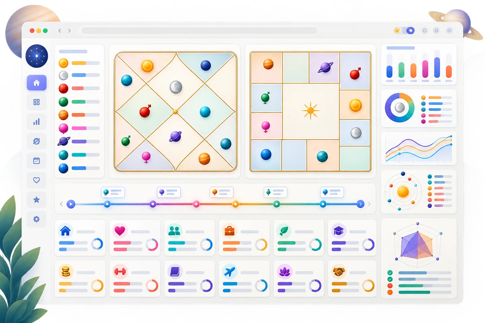
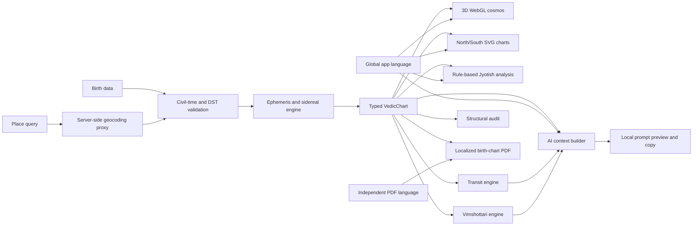

# Vedic Celestial Visualizer


<p align="center">
  <strong>A deterministic astronomy engine, explainable Jyotish workspace,
  interactive WebGL experience, and AI-ready context pipeline in one
  production-oriented TypeScript application.</strong>
</p>

<p align="center">
  <a href="https://github.com/diprajkadlag/VedicAstrologer/actions/workflows/ci.yml">
    
  </a>
  
  
  
  
  
</p>

## Try it — nothing to install

**<https://diprajkadlag.github.io/VedicAstrologer/>**

Runs entirely in the browser, on a phone as well as a desktop. There is no
server and no account: your birth details never leave the device. Place search
is the one network call, and it goes straight from your browser to
[Nominatim](https://nominatim.openstreetmap.org/) (© OpenStreetMap
contributors); the timezone for a place is resolved on-device.

To run it locally instead, double-click `start-VedicAstrologer.bat` on Windows,
or see [Development](#development).

> **Portfolio milestone:** this project explores how deterministic domain
> calculations, explainable rule systems, immersive visualization, multilingual
> UX, and safety-bounded LLM context construction can coexist without presenting
> symbolic interpretation as scientific prediction.

## Why this project exists

Vedic astrology software is a deceptively rich engineering problem. It combines
time-zone-sensitive input, astronomical coordinate transformations, spatial
visualization, domain rules, accessibility, localization, and interpretations
that require careful uncertainty boundaries.

This repository treats those concerns as separate, testable layers. The result
is useful as both an interactive Jyotish learning tool and an engineering case
study in:

- deterministic grounding before generative AI;
- schema-oriented context and prompt construction;
- transparent, inspectable rule contributions;
- real-time 3D rendering with graceful capability degradation;
- multilingual product design in English, हिन्दी, मराठी, and Deutsch;
- responsible communication of calculated, interpreted, and omitted data.

## Project at a glance

| Area | Implementation |
| --- | --- |
| Domain engine | Apparent geocentric positions from Astronomy Engine, a documented Lahiri-style sidereal conversion, Ascendant, whole-sign houses, lunar mansions and quarters, nodes, and Vimshottari periods |
| Visualization | Responsive React Three Fiber celestial sphere plus North and South Indian SVG birth charts |
| Explainability | Inspectable transit-score arithmetic, structural chart audits, calculation-status badges, methodology and limitation disclosures |
| AI engineering | Validated structured context, localized system policies, prompt-injection resistance, anti-fabrication constraints, and a local prompt preview/copy workflow |
| Product quality | Four languages, light-by-default plus dark theme, a single-page birth form, responsive layouts, keyboard-oriented controls, WebGL failure recovery, and civil-time/DST handling |
| Export | Client-side birth-chart PDF in an independently selected report language, including an audited twelve-house summary with locale-native labels |
| Verification | Vitest, TypeScript, ESLint, production-build gates, and continuous integration; exact current totals are reported by CI |
| Privacy | Birth data stays in browser memory; only an explicit place query uses geocoding, through the Node proxy or directly from the static GitHub Pages build |

## Feature tour

The landing experience includes a keyboard-operable visual showcase with
repository-owned promotional artwork for the cosmos, traditional charts,
analysis, time navigation, and PDF export. The primary cosmos, chart, and
report images are optimized WebP assets. The showcase sits beside the compact
birth form so visitors can understand the workflow before submitting data.

<table>
  <tr>
    <td width="50%">
      
      <br><strong>Spatial astronomy</strong> — inspect the sidereal sky in an
      orbitable, fullscreen WebGL scene.
    </td>
    <td width="50%">
      
      <br><strong>Traditional chart views</strong> — keep one calculated chart
      synchronized across North and South Indian layouts.
    </td>
  </tr>
  <tr>
    <td colspan="2">
      
      <br><strong>Readable analysis and export</strong> — inspect the
      color-coded twelve-house summary, navigate time, and download an audited
      report in the independently chosen PDF language without uploading it.
    </td>
  </tr>
</table>

### Single-page birth-data entry

- name, optional form of address, date, time, place, timezone, and advanced
  fallbacks remain visible in one efficient form
- one **Generate horoscope** action validates and submits the complete form;
  there is no multi-step wizard or intermediate Continue action
- inline field errors and an optional seconds-level time field keep correction
  local to the relevant input
- place search with automatic coordinates and timezone plus a manual fallback
- clear privacy and civil-time guidance before chart generation

### 3D geocentric cosmos

- Earth-centered celestial sphere with orbit, pan, and zoom controls
- 12 zodiac signs and all 27 lunar-mansion sectors, labeled for the selected
  language
- Sun, Moon, Mercury, Venus, Mars, Jupiter, Saturn, North Node, and South Node
  in English; German uses *Nordknoten* and *Südknoten*, while Hindi and Marathi
  use their native Devanagari names
- sampled ephemeris trails, selectable planets, responsive camera framing, and
  native fullscreen with automatic context-preserving enter/exit recovery
- preflight WebGL detection, bounded automatic context-loss recovery, and a
  localized fallback when graphics are disabled

### Jyotish chart and analysis workspace

- North Indian diamond and South Indian fixed-sign chart renderers
- synchronized planet and house selection across 3D, SVG, and analysis views
- core Ascendant/Sun/Moon placements and a detailed planetary position table
- all 12 house cards begin with exactly three color-coded, personalized
  sentences—traditional significance, this user's calculated chart context,
  and a balanced reflection—then expand into the fuller educational reading
- all 27 lunar mansions and Vimshottari major/subperiod timelines
- interactive 22-term guide, nine planetary profiles, and all 108
  planet-in-house educational combinations
- locale-native presentation: familiar English terms and zodiac names, German
  terms such as *Löwe*, *Sonne*, and *Mond*, and native Devanagari in Hindi and
  Marathi
- stable internal IDs and transliterations remain available to calculation and
  serialization code, but every visible surface uses only the selected
  language; AI presentation references expose locale-native astronomical names
  without parallel internal name IDs or transliterations
- English as the first-visit interface language; a language explicitly chosen
  by a returning user remains saved on that browser
- a labeled global language selector remains available beside the generated
  chart, so switching language after submission immediately updates the 3D
  viewer, charts, analysis, guide, transit views, and AI workspace

### Localized birth-chart summary

- explicit, on-demand PDF generation after the natal chart passes its
  structural audit
- an independent PDF-language selector offers English, हिन्दी, मराठी, or
  Deutsch without changing the application language
- three readable opening pages cover all 12 houses; every house has exactly
  three color-coded, personalized sentences: its traditional significance,
  the user's calculated sign/ruler/resident-planet context, and a balanced
  reflection rather than a fixed judgment
- calculated placements, current Vimshottari periods, methodology, and
  limitation disclosures use the selected language's presentation vocabulary
- browser-side generation with no PDF upload or report-storage service

### Transits and AI-ready reasoning

- daily Moon and monthly Sun–Mercury transit views
- Jupiter and Saturn notices relative to the Ascendant and birth Moon sign
- bounded scores with visible baseline and every rule contribution
- AI Astrologer workspace with five presets and natural-language questions
- deterministic natal/period/transit JSON context with localized prompt
  previews and separate system/user messages
- explicit local-only behavior: no model API is called in this milestone

## Architecture



The most important boundary is between **calculation** and **interpretation**:

1. Astronomical and chart data is computed into typed, serializable structures.
2. Traditional rules consume those structures and expose their assumptions.
3. The AI prompt builder receives only the validated snapshot and instructs a
   future model to separate facts, rules, and inference.
4. The UI discloses what is omitted instead of silently inventing missing
   methods.

Read the deeper design notes in [Architecture](docs/ARCHITECTURE.md) and the
[AI engineering case study](docs/AI_ENGINEERING.md).

## AI-engineering relevance

The current milestone deliberately stops before adding an external LLM. That is
an engineering choice, not an unfinished marketing claim.

The repository already implements the parts that determine whether an AI
feature is grounded and auditable:

- a versionable domain schema rather than a prose-only prompt;
- input validation and bounded question length;
- explicit response-locale policy;
- anti-prompt-injection and anti-fabrication instructions;
- required disclosure of conflicts, omitted calculations, and boundary
  uncertainty;
- separation of calculated placements, traditional rules, and model inference;
- privacy-preserving local preview before any future network request.

A production LLM gateway, retrieval/citations, trace storage, and an evaluation
dataset are documented as the next milestone rather than simulated in the UI.

## Technology

- **Application:** Next.js App Router, React, TypeScript
- **3D:** Three.js, React Three Fiber, Drei
- **UI:** Tailwind CSS, Framer Motion, Lucide
- **Astronomy:** Astronomy Engine
- **Time and location:** Temporal polyfill, geo-tz, OpenStreetMap Nominatim
- **Document export:** React PDF with bundled Noto Sans and Devanagari fonts
- **Quality:** Vitest, ESLint, TypeScript, GitHub Actions

## Run locally

### Requirements

- Node.js 20.9 or newer
- npm 11 or newer
- a modern browser; WebGL is optional for the rest of the dashboard but
  required for the 3D scene

### Development

```bash
git clone https://github.com/diprajkadlag/VedicAstrologer.git
cd VedicAstrologer
npm install
npm run dev
```

Open <http://localhost:3737>.

> **Why 3737 and not 3000?** A service worker claims a whole origin — scheme,
> host *and* port. Any other PWA you have ever opened on `http://localhost:3000`
> keeps answering navigations there and will show you its cached page instead of
> this app, whatever server is actually listening. If you have hit that already:
> open `http://localhost:3000`, press F12, then **Application → Service Workers
> → Unregister**, and hard-reload.

On Windows, if PowerShell blocks `npm.ps1`, use:

```powershell
npm.cmd run dev
```

### Production

```bash
npm run build
npm run start
```

## Verification

Run the same checks used by CI:

```bash
npm run typecheck
npm run lint
npm test
npm run build
```

Current milestone result:

```text
TypeScript passed
ESLint passed
Vitest passed
Next.js production build passed
```

The exact file and test totals evolve with the milestone and are visible in the
latest CI run; dated baseline results remain in the changelog.

Test coverage focuses on the failure-prone boundaries rather than only UI
snapshots:

- zodiac-sign, lunar-mansion, quarter, house, node, and period invariants
- civil-time ambiguity and daylight-saving transitions
- deterministic transit-score arithmetic
- locale-native interface, PDF, and prompt-preview naming across all four
  application languages
- context and prompt validation across all four application languages
- chart geometry and responsive camera framing
- WebGL capability classification and graceful fallback
- structural chart consistency audits

## Place-search configuration

Development works with the defaults. For deployment, copy `.env.example` to
`.env.local` and set an identifying user agent with real contact details:

```bash
NOMINATIM_USER_AGENT="VedicAstrologer/0.1 (contact: you@example.com)"
```

The app searches only on explicit submission. A server route adds throttling and
cache headers because the public Nominatim service does not permit client-side
autocomplete at scale. A production deployment with meaningful traffic should
use a dedicated provider or self-hosted Nominatim instance.

## If WebGL is disabled

The application checks graphics support before mounting Three.js. If the 3D
context cannot be created, the rest of the dashboard remains usable and the
cosmos displays recovery guidance.

1. Enable hardware acceleration in the browser and restart it.
2. Inspect `chrome://gpu` or `edge://gpu`; WebGL should not be disabled.
3. Update the graphics driver and remove any `--disable-gpu` launch flag.
4. Return to the app and select **Retry WebGL**.

Restricted remote-desktop, virtual-machine, or managed environments may require
an administrator to allow WebGL.

## Calculation and responsibility boundaries

The engine uses:

- apparent geocentric Sun, Moon, and planetary coordinates from Astronomy
  Engine;
- true ecliptic/equinox-of-date tropical positions;
- a custom Lahiri-style correction using a documented J2000 anchor,
  IAU-1976 precession, and truncated nutation;
- mean Rahu and Ketu, whole-sign houses, and a 365.25-day-year Vimshottari
  convention.

The approximately one-arcminute target belongs to the upstream Astronomy
Engine. This app's custom sidereal conversion has **not** been independently
certified against Swiss Ephemeris. Placements near a zodiac-sign,
lunar-mansion, or quarter boundary require extra caution.

The structural audit verifies internal software consistency. It does not
establish the scientific predictive validity of astrology. Interpretations and
Transit scores are traditional symbolic reflection material—not probabilities,
diagnoses, guaranteed events, or a basis for medical, legal, financial, safety,
or mental-health decisions.

## Repository map

```text
app/                          Next.js routes, layout, and global theme
components/3d/                WebGL scene, planets, lunar mansions, capability guard
components/chart/             North/South Indian SVG renderers
components/analysis/          Jyotish dashboard, guide, methodology, audit UI
components/dashboard/         Birth-chart, transit, and AI prompt workspaces
components/export/            Client-only localized birth-chart PDF generation
components/marketing/         Interactive illustrated feature showcase
components/providers/         Locale and theme preferences
components/ui/                Single-page birth form, term dialog, time navigator
lib/astro/                    Ephemeris, civil time, periods, education, audits
lib/transits.ts               Explainable transit rules
lib/aiPromptBuilder.ts        Validated structured context and prompt policies
public/features/              Promotional WebP and supporting feature-tour art
public/fonts/                 Bundled Noto fonts and license for PDF output
docs/                         Architecture and AI-engineering case study
.github/workflows/ci.yml      Reproducible pull-request and push validation
```

## Milestone and roadmap

See [CHANGELOG.md](CHANGELOG.md) for the current multilingual onboarding/PDF
milestone and the complete `v0.1.0` baseline.

Priorities for the next iteration:

- add real desktop/mobile screenshots and browser-level visual regression;
- add Playwright accessibility and end-to-end browser coverage;
- independently cross-check boundary-sensitive calculations;
- introduce an opt-in server-side LLM gateway with structured outputs;
- build a small expert-reviewed evaluation set for groundedness, citation
  coverage, refusal quality, and multilingual consistency;
- add observability with privacy-safe traces and prompt/model versioning.

## Project status

This is an active portfolio and learning project. The code is suitable for
technical review, experimentation, and discussion; it is not professional
astrological, medical, legal, or financial advice.

The source is available under the [MIT License](LICENSE). Astrological
interpretations remain cultural and symbolic material; the license is not a
claim of scientific validation or professional certification.

Built and maintained by [@diprajkadlag](https://github.com/diprajkadlag).
