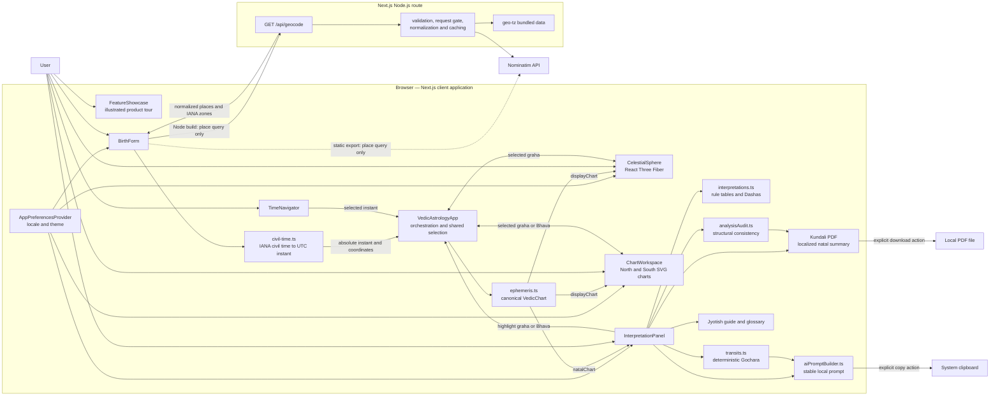
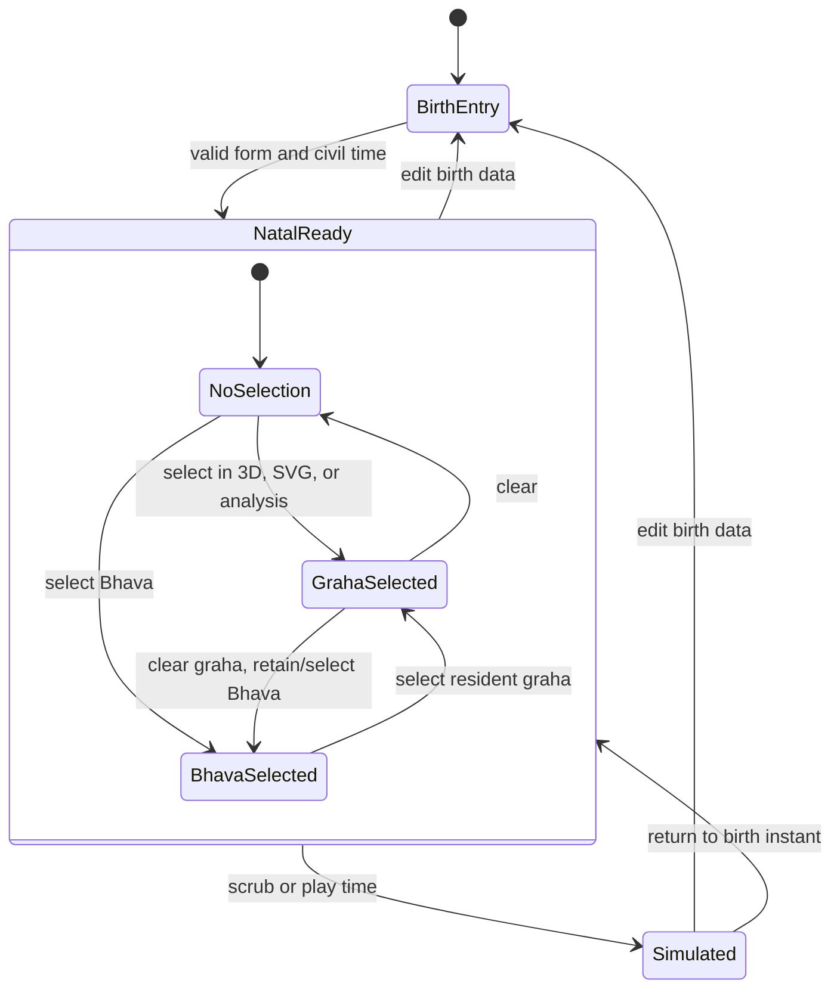

# Vedic Celestial Visualizer — Engineering Architecture

## 1. Scope

Vedic Celestial Visualizer is a single Next.js App Router application that combines:

- browser-side astronomical and Jyotish calculations;
- a guided, stepwise birth-data workflow;
- an interactive React Three Fiber celestial scene;
- North and South Indian SVG Rasi charts;
- deterministic natal, Vimshottari Dasha, and Gochara analysis;
- an interactive multilingual Jyotish guide;
- a localized client-side Kundali PDF summary;
- an illustrated, keyboard-operable feature showcase;
- a local AI-prompt preparation interface; and
- deployment-aware place search backed by OpenStreetMap Nominatim.

This document describes the implementation in the repository. It does not
assume a database, authentication service, hosted LLM, analytics pipeline, or
distributed cache; none of those are present in the current code.

## 2. System context and data flow

The principal architectural boundary is the `VedicChart` object exported by
`lib/astro/ephemeris.ts`. UI surfaces consume the same chart rather than
recalculating placements independently. This keeps 3D nodes, chart glyphs,
house membership, and analysis anchored to one typed model.

## 3. Runtime topology

### Browser runtime

`app/page.tsx` renders the client-side `VedicAstrologyApp`. Most domain
calculation is deliberately local:

- civil-time validation and DST disambiguation;
- natal and simulated ephemeris calculation;
- Dasha and interpretation assembly;
- transit comparison and scoring;
- structural chart audits;
- SVG chart layout;
- localized PDF assembly and download; and
- AI context and prompt construction.

Birth-chart state is held in React memory. A refresh does not restore a
generated chart. Only locale and theme preferences are persisted in
`localStorage`. The generated PDF is assembled on demand and downloaded by the
browser; the application does not upload or retain the report.

The WebGL bundle is loaded with `next/dynamic` and `ssr: false`. This isolates
browser-only Three.js APIs from server rendering and avoids putting the 3D
renderer on the initial server path.

### Server runtime and static export

`app/api/geocode/route.ts` is explicitly a Node.js route. It is the only
implemented application endpoint and, in the Node topology, the path to the
external geocoding service. It:

1. validates one `q` parameter;
2. calls Nominatim with fixed search parameters and an identifying user agent;
3. normalizes and whitelists returned fields;
4. derives IANA timezone candidates from bundled `geo-tz/all` data; and
5. returns a bounded result set with OpenStreetMap attribution.

No chart calculation or interpretation is sent to this route.

The GitHub Pages build is a different, explicitly configured topology.
`STATIC_EXPORT=1` excludes the route handler because no Node server exists. In
that build, `lib/geocoding/client.ts` loads the browser transport on demand,
calls Nominatim directly after explicit user input, and resolves timezones with
bundled `tz-lookup` data. Both transports share validation and normalization
logic. This means “birth data remains local” is accurate, while “the whole app
is offline” would not be: place search is still a network operation.

## 4. Layer and module map

| Layer | Primary modules | Responsibility |
| --- | --- | --- |
| App shell | `app/layout.tsx`, `app/page.tsx`, `app/globals.css` | Metadata, preference bootstrap, global theme tokens, responsive base styles |
| Orchestration | `components/VedicAstrologyApp.tsx` | Owns natal/display chart state, time simulation, error state, and synchronized graha/Bhava selection |
| Input and time | `components/ui/BirthForm.tsx`, `components/ui/TimeNavigator.tsx`, `lib/astro/civil-time.ts`, `lib/astro/instants.ts` | Six-step guided entry, per-step validation, place selection, optional seconds, IANA civil-time resolution, DST fold/gap handling, absolute-instant normalization |
| Astronomy | `lib/astro/ephemeris.ts` | Lahiri sidereal conversion, apparent geocentric grahas, Lagna, mean nodes, motion, whole-sign houses, and trajectory samples |
| Jyotish rules | `lib/astro/interpretations.ts`, `lib/astro/education.ts`, `lib/astro/glossary.ts` | House/graha/Nakshatra lookup data, personality synthesis, 108 graha-in-Bhava educational readings, and Vimshottari timelines |
| Analysis integrity | `lib/astro/analysisAudit.ts` | Internal consistency checks and explicit methodological limitations |
| Transit engine | `lib/transits.ts` | Recalculates a chart at an explicit instant and compares Gochara from natal Lagna and Janma Rasi |
| AI handoff | `lib/aiPromptBuilder.ts`, `components/dashboard/AiAstrologerTab.tsx` | Validates and serializes chart context, separates system policy from user JSON, previews and copies a prompt |
| Document export | `components/export/*`, `lib/export/*`, `public/fonts/*` | Builds a selected-language Kundali summary from the natal snapshot and downloads it locally with bundled fonts |
| Product introduction | `components/marketing/FeatureShowcase.tsx`, `public/features/*` | Keyboard-operable visual tour with lightweight repository-owned SVG illustrations |
| 3D presentation | `components/3d/*` | WebGL capability probe, responsive camera, Earth/celestial sphere, grahas, Nakshatras, trails, controls, and fullscreen |
| 2D presentation | `components/chart/*`, `components/dashboard/ChartWorkspace.tsx` | Interactive North and South Indian SVG chart layouts |
| Analysis UI | `components/analysis/*`, `components/dashboard/HoroscopeTab.tsx` | Overview, positions, Bhavas, Nakshatras, Dashas, Gochara, guide, methodology, and prompt tabs |
| Localization | `lib/i18n.ts`, `lib/astro/localizedNames.ts`, `lib/astro/localizedGlossary.ts`, component dictionaries | English, Hindi, Marathi, and German text, Sanskrit-first names, glossary content, and locale-aware number/date display |
| Geocoding | `app/api/geocode/route.node.ts`, `lib/geocoding/*` | Deployment-selected proxy/browser Nominatim transport, response normalization, timezone lookup, throttling, and HTTP errors |

## 5. Astronomy and Jyotish are separate domains

The code intentionally distinguishes reproducible coordinate calculation from
symbolic interpretation.

### Astronomical calculation

`lib/astro/ephemeris.ts` produces typed geometry and metadata without assigning
personality or predictive meaning:

- Sun, Moon, and physical-planet positions use Astronomy Engine's apparent
  geocentric vectors and true ecliptic-of-date coordinates.
- Sidereal longitude subtracts a documented Lahiri-style ayanamsa built from a
  J2000 anchor, IAU-1976 precession, and a truncated nutation correction.
- Rahu and Ketu are mean lunar nodes and are constructed 180 degrees apart.
- Lagna is the rising intersection of the true ecliptic with the local horizon.
- Bhavas use the whole-sign convention from the Lagna Rasi.
- Motion is sampled across a one-day centered window; the stored speed drives
  direct, stationary, and retrograde labels.
- Rasi, Nakshatra, and Pada are derived from normalized sidereal longitude.

The resulting object declares its coordinate system, house system, node model,
ayanamsa, observer location, and accuracy note. Consumers therefore do not have
to infer which convention produced a placement.

### Symbolic Jyotish interpretation

`lib/astro/interpretations.ts` and `lib/astro/education.ts` consume calculated
placements and apply explicit lookup rules:

- twelve Bhava meanings and nine-graha archetypes;
- a graha-in-Bhava effect for every supported combination;
- 27 Nakshatra profiles;
- Lagna and Moon-Nakshatra personality synthesis;
- Vimshottari Mahadasha and Antardasha periods; and
- constructive, cautionary, and reflective readings.

Vimshottari uses the canonical nine-lord 120-year sequence with a disclosed
365.25-day year. Other software or lineages can produce different boundary
dates when they use a different year convention.

`lib/transits.ts` uses the astronomical engine again at an explicit `asOf`
instant, then applies named, inspectable rule contributions. Scores start at
50, are clamped to 0–100, and expose their arithmetic. They are editorial
summaries, not probabilities or measured forecasts.

### Integrity boundary

`auditVedicChart` checks that derived fields agree with the chart's own rules:
Rasi/Nakshatra/Pada boundaries, graha membership, whole-sign ordering, motion
flags, coordinate metadata, and the Rahu–Ketu opposition. Passing the audit
means internal structural consistency only. The Methodology and Guide tabs
state that this does not validate astrology as a scientific predictive method.

## 6. UI state and synchronization

Before any chart exists, `BirthForm` owns a six-step wizard: name, optional
addressing/gender, date, time, place/timezone, and confirmation. Each transition
validates only the current responsibility, while Back and review-card Edit
actions preserve prior inputs. Time entry defaults to minute precision and can
be expanded to seconds. A final submission normalizes the civil time and hands
one immutable request to the chart orchestrator.

`VedicAstrologyApp` keeps two chart objects for two distinct purposes:

- `natalChart` remains fixed at the resolved birth instant and feeds natal
  interpretation, Dashas, transits, methodology, and AI context.
- `displayChart` follows the time navigator and feeds the 3D scene, headline
  positions, and SVG chart workspace.

This prevents a time-scrubber interaction from silently changing the natal
foundation.

Generation calculates both chart objects, initializes Bhava 1, and resets
graha selection. Time changes are coalesced through
`requestAnimationFrame` and committed through a React transition, preventing a
rapid slider stream from scheduling redundant chart renders. The 3D scene also
defers the chart used for trajectory sampling.

Graha selection is shared by the 3D scene and SVG workspace. Selecting a graha
also selects its Bhava; directly selecting a Bhava clears the graha. Analysis
buttons reuse the same callbacks, so an explanatory panel can highlight the
corresponding visual object.

The analysis panel owns view-specific state: active tab and a selected transit
reference date. Its keyboard-operable tab list supports arrow, Home, and End
navigation. Chart-style choice, time-window choice, guide filters, and prompt
drafts remain local to their respective components.

`analysisAsOf` is initialized to the current time and refreshed once per minute
while a natal chart exists. All lower-level calculation functions accept
explicit instants; they do not read the machine clock themselves.

## 7. 3D rendering and WebGL resilience

`CelestialSphere` builds a geocentric React Three Fiber scene from the same
`displayChart` used by the SVG workspace. The scene contains a central Earth,
stars, a zodiac band, 27 Nakshatra sectors, Lagna, graha nodes, and sampled
ephemeris trails. `OrbitControls` provides rotate, pan, and zoom, while
`AdaptiveDpr` adjusts rendering density.

The renderer has several containment layers:

1. **Client-only loading.** The entire component is dynamically imported with
   server rendering disabled.
2. **Capability preflight.** `webgl-capability.ts` probes WebGL 2 and then
   WebGL 1 on a disposable canvas. It recognizes unavailable/lost contexts and
   vendor or renderer strings that report a disabled graphics provider.
3. **Mount gate.** React Three Fiber's `Canvas` is not mounted until the probe
   returns a supported context. Unsupported browsers receive a localized
   English/Hindi/Marathi/German explanation, recovery guidance, and retry
   action while the SVG charts and analysis remain usable.
4. **Runtime containment.** A React error boundary catches renderer
   initialization failures. A `webglcontextlost` listener replaces a failed
   scene with the same safe fallback.
5. **Responsive sizing.** A `ResizeObserver` synchronizes the actual canvas
   host size with React Three Fiber. Camera distance is recalculated from the
   measured aspect ratio and the scene radius.
6. **Fullscreen transition.** The canvas remounts at the embedded/fullscreen
   boundary so its drawing buffer is measured against the new containing
   viewport.
7. **Motion and device sensitivity.** Reduced-motion preferences disable
   continuous decorative movement, and labels/trails use responsive defaults.

The cosmos is intentionally a dark-sky surface in both application themes.

## 8. Localization and themes

### Localization

The supported application locales are `en`, `hi`, `mr`, and `de`.
English is the first-visit default. A valid language explicitly selected by the
user is persisted and restored; absent, obsolete, or invalid values resolve to
English.
`defineMessages` uses the English dictionary as a TypeScript key contract, so
Hindi, Marathi, and German dictionaries must implement the same keys at compile
time. A runtime English fallback also protects development hot reloads and
persisted preferences while a new dictionary is temporarily incomplete; it is
a resilience measure, not permission to ship untranslated user flows.
Components own scoped dictionaries, while canonical Graha, Rasi, Nakshatra,
glossary, and educational text live in shared localization modules.

`INTL_LOCALES` maps the four application locales to `en-IN`, `hi-IN`, `mr-IN`,
and `de-DE` for locale-aware formatting. User-facing terminology remains
Sanskrit-first: names such as Mesha, Mithuna, Simha, Graha, Bhava, Nakshatra,
and Pada are localized or explained without replacing them with Western zodiac
names. The presentation mapping is centralized rather than allowing each
visual surface to invent labels.

`AstroTerm` exposes glossary entries through a native modal dialog rendered in
a portal. The separate Jyotish Guide provides searchable core terms, all nine
graha profiles, an interactive 9 × 12 graha/Bhava explorer, and the structural
integrity limitations in every supported language.

The formatting primitive intentionally supports simple named interpolation,
not a full ICU message grammar. Plural and grammatical variations are
therefore handled in component copy rather than by a localization service.

### Themes

The application supports `light` and `dark` themes. A small inline bootstrap
script in `app/layout.tsx` reads persisted preferences before React hydration,
applies the HTML `lang`, `data-locale`, and `data-theme` attributes, and uses
light as the first-visit default when no explicit theme is stored.

`AppPreferencesProvider` uses `useSyncExternalStore` to observe:

- `localStorage` changes across tabs;
- an application-local preference event; and
- system color-scheme changes.

It also updates the document title, description, theme color, and root
`color-scheme`. CSS custom properties provide semantic foreground, surface,
border, muted, accent, and focus colors. Compatibility selectors translate
older utility-based panels into the light palette while newer components use
the semantic tokens directly.

## 9. Geocoding, privacy, and rate limiting

Only an explicitly submitted place-search string enters the geocoding path.
The person's name, addressing/gender choice, birth date, birth time, selected
timezone, and calculated chart are not attached to that request.

Transport depends on the build:

- Node development/production sends `GET /api/geocode?q=...`; server code
  forwards only the normalized query and fixed parameters to Nominatim with the
  configured application user agent.
- The static GitHub Pages export has no route handler, so
  `lib/geocoding/browser.ts` calls Nominatim directly from the visitor's browser
  and resolves the timezone with bundled client data.

Deployment-platform, proxy, browser, and upstream logging policies are outside
this repository and must be evaluated separately. The application does not
claim that a network place query is private from those operators.

Shared defensive behavior in `lib/geocoding/shared.ts`, with server-specific
handling in `lib/geocoding/nominatim.ts`, includes:

- Unicode NFKC and whitespace normalization;
- rejection of control characters, missing/duplicate parameters, and queries
  outside the 3–120-character bounds;
- URL construction through `URL`/`URLSearchParams`, with credentials and
  non-HTTP(S) schemes rejected;
- a five-second upstream timeout;
- JSON content-type and 500,000-character response limits;
- field whitelisting, coordinate validation, duplicate removal, and a maximum
  of five results;
- no-store caching for server errors and explicit public caching for server
  successes;
- in-flight coalescing for identical normalized upstream URLs; and
- a shared in-memory request gate that spaces upstream starts by 1.1
  seconds and rejects work when four requests are already pending.

In the Node topology, the Next.js fetch request also declares a seven-day
revalidation interval.
Successful Node API responses advertise one-day browser freshness, seven-day
shared freshness, and stale-while-revalidate behavior. These layers reduce
repeated Nominatim traffic.

The request gate is intentionally small and in-memory. It coordinates one
Node.js process or one browser tab, depending on the topology; it is not a
distributed rate limiter, per-user quota, or complete abuse-prevention system
across multiple deployment instances. A multi-instance public deployment would
need infrastructure-level controls that are not implemented here.

The form provides a manual coordinate and IANA-timezone path when place search
is unavailable or unsuitable.

## 10. AI prompt boundary

The “AI Astrologer” tab does not call an LLM. It builds a local, reviewable
handoff:

1. `buildAstrologyContext` verifies that the natal chart, birth instant,
   transit instant, and transit natal reference agree.
2. It emits a versioned, JSON-safe payload containing the natal model,
   placements, whole-sign rulers, current Dasha, and transits.
3. `sanitizeAstrologerQuestion` normalizes the question, removes control and
   delimiter-like characters, and enforces a 1,200-character limit.
4. `buildAiAstrologerPrompt` keeps policy in a system string and untrusted
   context/question data in stable-key-order user JSON.
5. The UI previews both parts and copies them only after an explicit action.

System instructions require the selected app language, Sanskrit Rasi names,
separation of calculated data from traditional rules and inference, disclosure
of conflicts and missing methods, and non-deterministic language.

The generated JSON contains birth coordinates and chart data. The UI warns the
user to review it before sharing. Because there is no configured LLM transport,
provider authentication, streaming response, or server-side secret management
in this repository, those concerns remain outside the current architecture.

## 11. Testing and quality gates

The project uses TypeScript, ESLint, and Vitest:

- `npm run typecheck` validates type contracts, including localization-key
  parity.
- `npm run lint` applies the Next.js ESLint configuration.
- `npm test` runs deterministic unit tests.
- `npm run build` exercises the production Next.js compiler and bundler.

The tests emphasize pure boundaries and invariants:

| Test area | Representative guarantees |
| --- | --- |
| Ephemeris | angle wrapping, Rasi/Nakshatra/Pada boundaries, Lahiri reference values, complete whole-sign charts, mean-node opposition, ascendant orientation, retrograde motion, trajectories, invalid inputs |
| Civil time | calendar validation, historical offsets, IANA zones, DST gaps, DST folds, explicit disambiguation |
| Interpretation | complete lookup tables, every graha/Bhava pair, all 27 Nakshatras, deterministic analysis, Dasha continuity and exact boundaries |
| Analysis audit | detection of inconsistent placements, houses, nodes, motion, coordinates, and model metadata |
| Transits | whole-sign reference mapping, deterministic dates, named score arithmetic, Saturn/Jupiter notices, validation |
| AI handoff | complete JSON-safe context, Sanskrit Rasi names, timestamp/reference consistency, stable serialization, localized safety policy, adversarial question separation |
| Localization and education | four-language key parity, Devanagari labels, Sanskrit-first names, clickable glossary coverage, nine grahas, twelve Bhavas, and all 108 educational combinations |
| Geocoding | query and URL safety, upstream field whitelisting, timezone lookup, coalescing, request spacing, cache/error semantics |
| Charts and 3D helpers | traditional SVG layout maps, localized accessibility text, responsive camera math, and WebGL disabled/lost/fallback classification |

The repository does not currently include browser end-to-end tests, automated
visual regression, GPU-matrix testing, or live Nominatim contract tests. WebGL
and layout tests cover pure decision logic; final rendering behavior still
depends on the browser, graphics stack, fonts, and viewport.

## 12. Key decisions and tradeoffs

### One canonical chart, multiple projections

Using a single `VedicChart` prevents the 3D, SVG, and analysis layers from
drifting. The tradeoff is that changes to the chart contract affect many
consumers, so the type and invariant tests are important.

### Natal state is immutable; simulation is separate

Keeping `natalChart` distinct from `displayChart` makes time simulation safe and
predictable. It uses more application state, but avoids treating a simulated
instant as a new birth chart.

### Client-side calculation

Local calculation avoids a chart-computation API and keeps birth data out of an
application server path. It also provides immediate interaction after loading.
The cost is main-thread work for recalculation and trajectory sampling. Current
mitigations are animation-frame coalescing, React transitions, deferred
trajectory input, code-split WebGL, and adaptive device-pixel ratio; there is no
Web Worker implementation.

### Explicit Jyotish convention

Lahiri sidereal coordinates, whole-sign Bhavas, and mean lunar nodes make the
model reproducible. They do not represent every Jyotish convention, and
boundary placements can differ under another ayanamsa, true nodes, or another
house system.

### Transparent deterministic rules

Static interpretation tables and named transit contributions are inspectable,
testable, and reproducible. They are necessarily narrower than a full classical
practice and cannot justify scientific, psychological, or event-prediction
claims.

### SVG for charts, WebGL for spatial exploration

SVG provides crisp, semantic, interactive traditional chart layouts. WebGL
adds spatial context and direct manipulation but depends on GPU/browser
support. The capability gate ensures that a WebGL failure does not remove the
core chart and analysis experience.

### Local prompt preparation instead of embedded AI

Preparing a stable prompt locally avoids provider lock-in, API keys, automatic
birth-data transmission, and opaque server behavior. It does not deliver an
in-app model response; the user must deliberately copy the payload and choose
where to use it.

### Client-side PDF instead of a report service

Generating the Kundali summary in the browser keeps the report tied to the
audited natal snapshot and avoids uploading birth data to a document service.
Bundled Noto fonts make Latin and Devanagari output reproducible across the four
locales. The tradeoffs are a larger on-demand client chunk, browser-dependent
download behavior, and a deliberately bounded report rather than a
server-rendered archival document.

## 13. Known model and product limitations

The implemented engine does not calculate Shadbala, divisional/Varga charts,
classical Drishti, Yuti orbs, combustion, yogas, Ashtakavarga, rectification,
or event probabilities. Glossary entries for such terms are educational, not
chart results.

Additional constraints exposed by the code are:

- birth-time or location uncertainty can materially change Lagna and Bhavas;
- exact geographic poles are unsupported by the ascendant calculation;
- placements near Rasi, Nakshatra, or Pada boundaries should be treated as
  uncertain at the declared ephemeris tolerance;
- the custom Lahiri implementation is documented but is not independently
  certified against Swiss Ephemeris or JPL for every supported input;
- the approximately one-arcminute figure is inherited as an engineering target,
  not a repository benchmark or universal certification;
- mean-node positions can differ from true-node results near boundaries;
- Dasha dates depend on the disclosed 365.25-day-year convention;
- transit scores are app-specific symbolic summaries, not probabilities;
- the downloadable PDF is a presentation of the same application model, not
  an independent ephemeris cross-check or professional certification;
- all interpretive content is traditional and symbolic rather than
  scientifically validated personality or outcome prediction; and
- medical, legal, financial, mental-health, safety, fertility, mortality, and
  other consequential decisions require qualified evidence-based guidance.

These limitations are not only documentation: they are represented in
`ANALYSIS_LIMITATIONS`, localized in the application, surfaced in the Guide and
Methodology tabs, and reinforced by the AI prompt policy.
